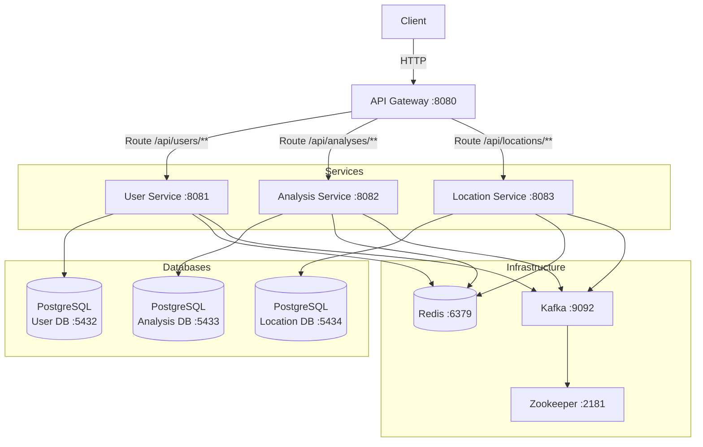

# Skydive Forecast

[](https://openjdk.org/)
[](https://spring.io/projects/spring-boot)
[](https://www.docker.com/)
[](https://opensource.org/licenses/MIT)


A comprehensive microservices-based system for analyzing weather conditions and generating skydive forecasts. Built with Spring Boot, this project demonstrates modern software architecture patterns including hexagonal architecture, event-driven design, and containerization.

### Status: **In Development**

## Overview

Skydive Forecast helps skydivers make informed decisions by analyzing weather conditions at various dropzones. The system processes weather data, evaluates skydiving conditions, and generates AI-powered recommendations using OpenAI integration.

## Architecture

The system follows a microservices architecture with clear separation of concerns:



### Service Responsibilities

- **API Gateway** (Port 8080): Central entry point, routes requests to microservices, aggregates API documentation
- **User Service** (Port 8081): Authentication, authorization, JWT tokens, RBAC, user management
- **Analysis Service** (Port 8082): Weather analysis, AI-powered forecasts, asynchronous report generation
- **Location Service** (Port 8083): Dropzone management, geographical data, location-based queries

## Technology Stack

### Core Technologies
- **Java 21** - Modern Java features and performance
- **Spring Boot 3.5.6** - Microservices framework
- **Spring Cloud Gateway** - API gateway and routing
- **Spring Security** - JWT-based authentication
- **Spring Data JPA** - Database access with Hibernate
- **PostgreSQL 15** - Relational database (separate instance per service)
- **Redis 7** - Caching and session management
- **Apache Kafka** - Event streaming and asynchronous messaging
- **Liquibase** - Database schema versioning

### Additional Tools
- **Spring AI with OpenAI** - AI-powered forecast recommendations
- **Resilience4j** - Circuit breaker pattern for fault tolerance
- **MapStruct** - DTO mapping
- **Lombok** - Boilerplate reduction
- **SpringDoc OpenAPI 2.8.13** - API documentation (Swagger)
- **Testcontainers** - Integration testing
- **Docker & Docker Compose** - Containerization

### Architecture Patterns
- **Hexagonal Architecture** (Ports and Adapters)
- **Event-Driven Architecture** (Kafka)
- **API Gateway Pattern**
- **Circuit Breaker Pattern**

## Prerequisites

- **Docker**  installed
- **Git** for cloning repositories
- **Java 21** (if running services locally without Docker)
- **Maven 3.x** (if building locally)

## Quick Start

### 1. Clone All Repositories

Run the setup script to clone all microservice repositories:

```bash
chmod +x setup.sh
./setup.sh
```

This will clone:
- `skydive-forecast-gateway`
- `skydive-forecast-user-service`
- `skydive-forecast-analysis-service`
- `skydive-forecast-location-service`

### 2. Start All Services

Build and start all services with Docker Compose:

```bash
docker-compose up --build
```

This command will:
- Build Docker images for all microservices
- Start PostgreSQL databases (3 instances)
- Start Redis for caching
- Start Kafka and Zookeeper for messaging
- Start all microservices
- Start the API Gateway

**First startup may take 2-3 minutes** as services initialize and run database migrations.

### 3. Verify Services

Check that all services are running:

```bash
docker-compose ps
```

All services should show status as "healthy".

### 4. Access the Application

- **API Gateway**: http://localhost:8080
- **Swagger UI** (Aggregated): http://localhost:8080/swagger-ui.html
- **OpenAPI Docs**: http://localhost:8080/v3/api-docs

Individual service documentation:
- User Service: http://localhost:8081/swagger-ui.html
- Analysis Service: http://localhost:8082/swagger-ui.html
- Location Service: http://localhost:8083/swagger-ui.html

## API Documentation

### Main Endpoints

#### User Management (`/api/users/**`)
- `POST /api/users/auth/register` - Register new user
- `POST /api/users/auth/login` - Login and get JWT token
- `POST /api/users/auth/refresh` - Refresh access token
- `GET /api/users/{id}` - Get user details
- `PUT /api/users/{id}` - Update user

#### Location Management (`/api/locations/**`)
- `GET /api/locations/dropzones` - List all dropzones
- `POST /api/locations/dropzones` - Create dropzone
- `GET /api/locations/dropzones/{id}` - Get dropzone details
- `GET /api/locations/dropzones/city/{city}` - Find dropzones by city
- `PUT /api/locations/dropzones/{id}` - Update dropzone
- `DELETE /api/locations/dropzones/{id}` - Delete dropzone

#### Weather Analysis (`/api/analyses/**`)
- `POST /api/analyses/weather-reports` - Request weather report
- `GET /api/analyses/weather-reports/{id}` - Get weather report
- `GET /api/analyses/weather-reports` - List weather reports

## Development

### Running Services Locally (Without Docker)

1. **Start infrastructure services**:
```bash
docker-compose up postgres-user postgres-analysis postgres-location redis kafka zookeeper
```

2. **Run each service**:
```bash
# In each service directory:
cd skydive-forecast-user-service
mvn spring-boot:run -Dspring-boot.run.profiles=dev

cd ../skydive-forecast-analysis-service
mvn spring-boot:run -Dspring-boot.run.profiles=dev

cd ../skydive-forecast-location-service
mvn spring-boot:run -Dspring-boot.run.profiles=dev

cd ../skydive-forecast-gateway
mvn spring-boot:run -Dspring-boot.run.profiles=dev
```

### Building Services

```bash
# Build all services
for dir in skydive-forecast-*/; do
    cd "$dir"
    mvn clean package
    cd ..
done
```

### Running Tests

```bash
# Run tests for all services
for dir in skydive-forecast-*/; do
    cd "$dir"
    mvn test
    cd ..
done
```

## Project Structure

```
skydive-forecast/
├── skydive-forecast-gateway/          # API Gateway (Port 8080)
├── skydive-forecast-user-service/     # User Management (Port 8081)
├── skydive-forecast-analysis-service/ # Weather Analysis (Port 8082)
├── skydive-forecast-location-service/ # Location Management (Port 8083)
├── docker-compose.yml                 # Docker Compose configuration
├── setup.sh                           # Repository setup script
└── README.md                          # This file
```

Each microservice follows **Hexagonal Architecture**:
```
service/
├── src/main/java/com/skydiveforecast/
│   ├── application/service/     # Business logic (Use Cases)
│   ├── domain/                  # Domain models and ports
│   └── infrastructure/          # Adapters and configurations
│       ├── adapter/            # REST controllers, DTOs
│       ├── persistence/        # JPA repositories
│       ├── kafka/              # Kafka consumers/producers
│       └── security/           # JWT authentication
└── src/main/resources/
    └── db/changelog/           # Liquibase migrations
```

## Security

- **JWT Authentication**: All services use JWT tokens for authentication
- **Permission-Based Authorization**: Fine-grained access control with custom permissions
- **Role-Based Access Control (RBAC)**: Users, roles, and permissions management
- **Shared JWT Secret**: All services validate tokens with the same secret

## Monitoring & Health

All services expose health check endpoints:

```bash
# Check gateway health
curl http://localhost:8080/actuator/health

# Check individual services
curl http://localhost:8081/actuator/health  # User Service
curl http://localhost:8082/actuator/health  # Analysis Service
curl http://localhost:8083/actuator/health  # Location Service
```

## Stopping Services

```bash
# Stop all services
docker-compose down

# Stop and remove volumes (clean state)
docker-compose down -v
```

## Troubleshooting

### Services not starting
- Check if ports 8080-8083, 5432-5434, 6379, 9092, 2181 are available
- Verify Docker has enough resources (4GB RAM minimum recommended)
- Check logs: `docker-compose logs [service-name]`

### Database connection issues
- Wait for databases to be fully initialized (check health status)
- Verify database credentials in `docker-compose.yml`

### Kafka connectivity issues
- Ensure Zookeeper is running: `docker-compose logs zookeeper`
- Check Kafka logs: `docker-compose logs kafka`
- Kafka may take 30-60 seconds to fully initialize

## License

This project is part of a portfolio demonstration.

## Contact

For questions or support, please contact me.
