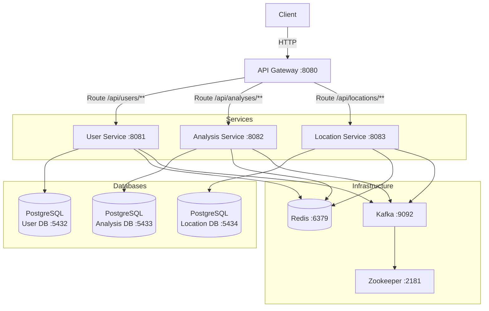

# Skydive Forecast

[](https://openjdk.org/)
[](https://spring.io/projects/spring-boot)
[](https://spring.io/projects/spring-cloud)
[](https://www.docker.com/)
[](https://opensource.org/licenses/MIT)


A comprehensive microservices-based system for analyzing weather conditions and generating skydive forecasts. Built with Spring Boot, this project demonstrates software architecture patterns including hexagonal architecture, event-driven design, and containerization.

### Status: **In Development**

## Overview

Skydive Forecast helps skydivers make informed decisions by analyzing weather conditions at various dropzones. The system processes weather data, evaluates skydiving conditions, and generates AI-powered recommendations using OpenAI integration.

## Architecture

The system follows a microservices architecture with clear separation of concerns:



### Service Responsibilities

- **Consul** (Port 8500): Service discovery, health checking, service registry with UI
- **Config Server** (Port 8888): Centralized configuration management
- **API Gateway** (Port 8080): Central entry point, routes requests via service discovery, aggregates API documentation
- **User Service** (Port 8081): Authentication, authorization, JWT tokens, RBAC, user management
- **Analysis Service** (Port 8082): Weather analysis, AI-powered forecasts, asynchronous report generation
- **Location Service** (Port 8083): Dropzone management, geographical data, location-based queries

## Technology Stack

### Core Technologies
- **Java 21** - Modern Java features and performance
- **Spring Boot 3.5.6** - Microservices framework
- **Spring Cloud Gateway** - API gateway and routing
- **Spring Security** - JWT-based authentication
- **Spring Data JPA** - Database access with Hibernate
- **PostgreSQL 15** - Relational database (separate instance per service)
- **Redis 7** - Caching and session management
- **Apache Kafka** - Event streaming and asynchronous messaging
- **Monitoring**: Actuator, OpenTelemetry, Prometheus, Grafana, Loki, Jaeger
- **Liquibase** - Database schema versioning
- **Docker** - Containerization
- **Docker Compose** - Container orchestration

### Additional Tools
- **Spring AI with OpenAI** - AI-powered forecast recommendations
- **OpenTelemetry** - Unified observability (traces, metrics, logs)
- **Resilience4j** - Circuit breaker pattern for fault tolerance
- **MapStruct** - DTO and entity mapping
- **Lombok** - Boilerplate reduction
- **SpringDoc OpenAPI** - API documentation
- **Testcontainers** - Integration testing with PostgreSQL and Kafka
- **JUnit 5 & Mockito** - Unit testing
- **JaCoCo** - Code coverage (70% minimum)
- **WireMock & MockWebServer** - External service mocking

### Architecture Patterns
- **Hexagonal Architecture** (Ports and Adapters)
- **Event-Driven Architecture** (Kafka)
- **API Gateway Pattern**
- **Circuit Breaker Pattern**

## Prerequisites

- **Docker**  installed
- **Git** for cloning repositories
- **Java 21** (if running services locally without Docker)
- **Maven 3.x** (if building locally)

## Quick Start

### 1. Clone All Repositories

Run the setup script to clone all microservice repositories:

```bash
chmod +x setup.sh
./setup.sh
```

This will clone:
- `skydive-forecast-gateway`
- `skydive-forecast-user-service`
- `skydive-forecast-analysis-service`
- `skydive-forecast-location-service`

### 2. Start All Services

Build and start all services with Docker Compose:

```bash
docker-compose up --build
```

This command will:
- Build Docker images for all microservices
- Start PostgreSQL databases (3 instances)
- Start Redis for caching
- Start Kafka and Zookeeper for messaging
- Start all microservices
- Start the API Gateway

**First startup may take 2-3 minutes** as services initialize and run database migrations.

### 3. Verify Services

Check that all services are running:

```bash
docker-compose ps
```

All services should show status as "healthy".

### 4. Access the Application

- **API Gateway**: http://localhost:8080
- **Consul UI**: http://localhost:8500 (Service Discovery Dashboard)
- **Swagger UI** (Aggregated): http://localhost:8080/swagger-ui.html
- **OpenAPI Docs**: http://localhost:8080/v3/api-docs

Individual service documentation:
- User Service: http://localhost:8081/swagger-ui.html
- Analysis Service: http://localhost:8082/swagger-ui.html
- Location Service: http://localhost:8083/swagger-ui.html

## API Documentation

### Main Endpoints

#### Authentication (`/api/users/**`)
- `POST /api/users/auth/token` - Generate JWT token (login)
- `POST /api/users/auth/refresh` - Refresh JWT token

#### User Management (`/api/users/**`)
- `GET /api/users` - Get all users (requires `USER_VIEW` permission)
- `POST /api/users` - Create new user (requires `USER_CREATE` permission)
- `PUT /api/users/{user-id}` - Update user (requires `USER_EDIT` permission)
- `PATCH /api/users/{user-id}/status` - Activate/deactivate user (requires `USER_STATUS_UPDATE` permission)
- `PATCH /api/users/me/password` - Change password (requires `USER_PASSWORD_CHANGE` permission)

#### Role & Permission Management (`/api/users/**`)
- `GET /api/users/roles` - Get all roles
- `POST /api/users/roles?role-name={name}` - Create new role
- `DELETE /api/users/roles/{role-id}` - Delete role
- `GET /api/users/permissions` - Get all permissions
- `POST /api/users/permissions` - Create permission
- `GET /api/users/role-permissions/role/{role-id}` - Get permissions by role
- `POST /api/users/role-permissions` - Assign permission to role
- `GET /api/users/user-roles/user/{user-id}` - Get roles for user
- `POST /api/users/user-roles` - Assign role to user

#### Location Management (`/api/locations/**`)
- `GET /api/locations/dropzones` - List all dropzones (requires `DROPZONE_VIEW` permission)
- `POST /api/locations/dropzones` - Create dropzone (requires `DROPZONE_CREATE` permission)
- `GET /api/locations/dropzones/{id}` - Get dropzone details (requires `DROPZONE_VIEW` permission)
- `GET /api/locations/dropzones/city/{city}` - Find dropzones by city (requires `DROPZONE_VIEW` permission)
- `PUT /api/locations/dropzones/{id}` - Update dropzone (requires `DROPZONE_UPDATE` permission)
- `DELETE /api/locations/dropzones/{id}` - Delete dropzone (requires `DROPZONE_DELETE` permission)

#### Weather Analysis (`/api/analyses/**`)
- `POST /api/analyses/reports/request` - Request weather report generation (async)
- `GET /api/analyses/reports/{reportId}` - Get weather report by ID
- `GET /api/analyses/reports` - List all user reports
- `GET /api/analyses/reports/latest` - Get latest user report

## Development

### Running Services Locally (Without Docker)

1. **Start infrastructure services**:
```bash
docker-compose up postgres-user postgres-analysis postgres-location redis kafka zookeeper
```

2. **Run each service**:
```bash
# In each service directory:
cd skydive-forecast-user-service
mvn spring-boot:run -Dspring-boot.run.profiles=dev

cd ../skydive-forecast-analysis-service
mvn spring-boot:run -Dspring-boot.run.profiles=dev

cd ../skydive-forecast-location-service
mvn spring-boot:run -Dspring-boot.run.profiles=dev

cd ../skydive-forecast-gateway
mvn spring-boot:run -Dspring-boot.run.profiles=dev
```

### Building Services

```bash
# Build all services
for dir in skydive-forecast-*/; do
    cd "$dir"
    mvn clean package
    cd ..
done
```

### Running Tests

```bash
# Run tests for all services
for dir in skydive-forecast-*/; do
    cd "$dir"
    mvn test
    cd ..
done
```

## Project Structure

This project uses a **multi-repository** approach where each microservice is maintained in its own Git repository:

```
Parent Directory/
├── skydive-forecast/                  # Main orchestration repository
│   ├── docker-compose.yml            # Docker Compose configuration
│   ├── setup.sh                      # Repository setup script
│   ├── monitoring/                   # Monitoring configurations
│   └── README.md                     # This file
│
├── skydive-forecast-gateway/          # API Gateway repository (Port 8080)
├── skydive-forecast-user-service/     # User Service repository (Port 8081)
├── skydive-forecast-analysis-service/ # Analysis Service repository (Port 8082)
├── skydive-forecast-location-service/ # Location Service repository (Port 8083)
└── skydive-forecast-config-server/    # Config Server repository (Port 8888)
```

Each microservice follows **Hexagonal Architecture**:
```
service/
├── src/main/java/com/skydiveforecast/
│   ├── application/service/     # Business logic (Use Cases)
│   ├── domain/                  # Domain models and ports
│   └── infrastructure/          # Adapters and configurations
│       ├── adapter/            # REST controllers, DTOs
│       ├── persistence/        # JPA repositories
│       ├── kafka/              # Kafka consumers/producers
│       └── security/           # JWT authentication
└── src/main/resources/
    └── db/changelog/           # Liquibase migrations
```

## Security

- **JWT Authentication**: All services use JWT tokens for authentication
- **Permission-Based Authorization**: Fine-grained access control with custom permissions
- **Role-Based Access Control (RBAC)**: Users, roles, and permissions management
- **Shared JWT Secret**: All services validate tokens with the same secret

## Test Accounts

The system comes pre-configured with test accounts for demonstration purposes:

### Admin Account
- **Email**: `admin@skydive.com`
- **Password**: `Admin123!`
- **Role**: ADMIN
- **Permissions**: Full system access
- **Status**: Active

### Regular User Account
- **Email**: `user@skydive.com`
- **Password**: `User123!`
- **Role**: USER
- **Permissions**: Basic user operations
- **Status**: Active

**Usage Example:**
```bash
# Login as admin
curl -X POST http://localhost:8080/api/users/auth/token \
  -H "Content-Type: application/json" \
  -d '{"email":"admin@skydive.com","password":"Admin123!"}'

# Login as regular user
curl -X POST http://localhost:8080/api/users/auth/token \
  -H "Content-Type: application/json" \
  -d '{"email":"user@skydive.com","password":"User123!"}'
```

## Monitoring & Health

All services expose health check endpoints:

```bash
# Check gateway health
curl http://localhost:8080/actuator/health

# Check individual services
curl http://localhost:8081/actuator/health  # User Service
curl http://localhost:8082/actuator/health  # Analysis Service
curl http://localhost:8083/actuator/health  # Location Service
```

## Stopping Services

```bash
# Stop all services
docker-compose down

# Stop and remove volumes (clean state)
docker-compose down -v
```

## Kubernetes Deployment

The project includes production-ready Helm charts for Kubernetes deployment.

### Quick Start with Kubernetes

```bash
# Build Docker images
cd helm
./build-images.sh

# Install to Kubernetes
helm install skydive-forecast ./skydive-forecast -n skydive-forecast --create-namespace

# Access services
kubectl port-forward svc/gateway 8080:8080 -n skydive-forecast
```

### Features

- **High Availability**: 2 replicas per microservice
- **Auto-scaling**: HorizontalPodAutoscaler ready
- **Health Checks**: Liveness and readiness probes
- **Resource Management**: CPU/Memory limits and requests
- **Service Discovery**: Native Kubernetes DNS
- **Load Balancing**: Kubernetes Services
- **Monitoring**: Prometheus + Grafana included

See [helm/README.md](helm/README.md) for detailed Kubernetes deployment guide.

## Monitoring

The service includes comprehensive monitoring capabilities:

### Metrics (Prometheus)

- **Endpoint**: `http://localhost:19090`
- **Metrics**: JVM, HTTP requests, database connections, Kafka consumers, Redis cache
- **Service Endpoints**:
  - Gateway: `http://localhost:8080/actuator/prometheus`
  - User Service: `http://localhost:8081/actuator/prometheus`
  - Analysis Service: `http://localhost:8082/actuator/prometheus`
  - Location Service: `http://localhost:8083/actuator/prometheus`

### Health Checks

- **Gateway**: `http://localhost:8080/actuator/health`
- **User Service**: `http://localhost:8081/actuator/health`
- **Analysis Service**: `http://localhost:8082/actuator/health`
- **Location Service**: `http://localhost:8083/actuator/health`

### Logs (Loki)

- **Endpoint**: `http://localhost:13100`
- Application logs are automatically sent to Loki for centralized log aggregation

### Distributed Tracing (Jaeger)

- **Endpoint**: `http://localhost:16686`
- **Traces**: Request flows across services with timing information
- **Sampling**: 100% of requests traced (configurable)
- **Features**: Service dependency graph, trace comparison, performance analysis

### OpenTelemetry Collector

- **OTLP gRPC**: `http://localhost:4317`
- **OTLP HTTP**: `http://localhost:4318`
- **Metrics Endpoint**: `http://localhost:8889/metrics`
- **Purpose**: Unified telemetry data collection and export

### Grafana Dashboards

- **Endpoint**: `http://localhost:3000` (admin/admin)
- Recommended dashboard: Import ID **11378** (JVM Micrometer)

## Troubleshooting

### Services not starting
- Check if required ports are available:
  - Services: 8080-8083
  - PostgreSQL: 15432-15434
  - Redis: 16379
  - Kafka: 19092, 29092
  - Zookeeper: 2181
  - Monitoring: 3000 (Grafana), 19090 (Prometheus), 13100 (Loki), 16686 (Jaeger)
  - OpenTelemetry: 4317 (gRPC), 4318 (HTTP), 8889 (metrics)
- Verify Docker has enough resources (4GB RAM minimum recommended)
- Check logs: `docker-compose logs [service-name]`

### Database connection issues
- Wait for databases to be fully initialized (check health status)
- Verify database credentials in `docker-compose.yml`
- Check PostgreSQL logs: `docker-compose logs postgres-user postgres-analysis postgres-location`

### Kafka connectivity issues
- Ensure Zookeeper is running: `docker-compose logs zookeeper`
- Check Kafka logs: `docker-compose logs kafka`
- Kafka may take 30-60 seconds to fully initialize

### Swagger/OpenAPI issues
- Gateway aggregates OpenAPI docs from all services
- Individual service docs available at:
  - User: `http://localhost:8081/v3/api-docs/users`
  - Analysis: `http://localhost:8082/v3/api-docs/analyses`
  - Location: `http://localhost:8083/v3/api-docs/locations`

## License

This project is part of a portfolio demonstration.

## Contact

For questions or support, please contact me.
